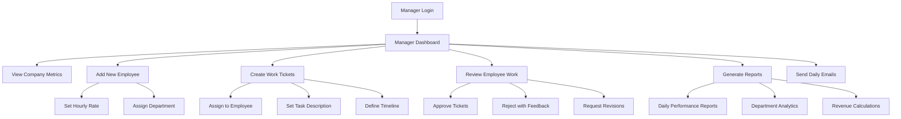
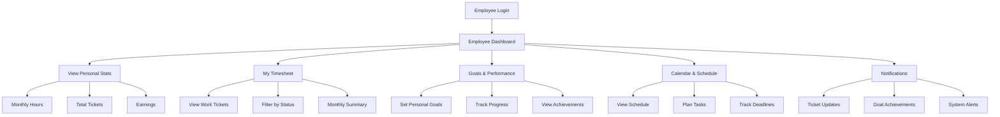
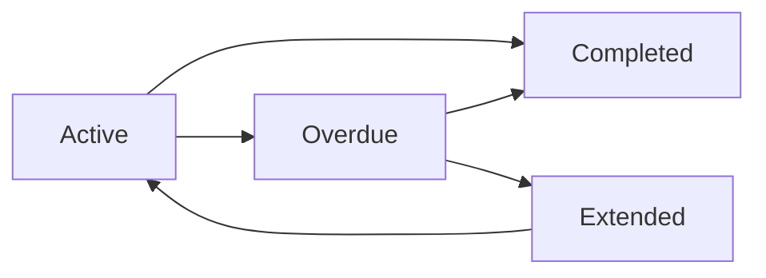

# Nano Computing ICT Employee Management System
## Database Schema & Workflow Documentation

### 🏗️ **System Architecture Overview**

The Nano Computing ICT Employee Management System is a comprehensive workforce management platform built with React, TypeScript, and a mock authentication system. The system supports role-based access control with Manager and Employee user types, each having distinct capabilities and interfaces.

---

## 📊 **Database Schema**

### **Core Tables**

#### **1. Users/Profiles Table**
```sql
CREATE TABLE profiles (
    id                  UUID PRIMARY KEY DEFAULT gen_random_uuid(),
    email              VARCHAR(255) UNIQUE NOT NULL,
    full_name          VARCHAR(255) NOT NULL,
    role               VARCHAR(20) CHECK (role IN ('manager', 'employee')) NOT NULL,
    hourly_rate        DECIMAL(10,2) NULL,
    department         VARCHAR(100) NULL,
    created_at         TIMESTAMP WITH TIME ZONE DEFAULT NOW(),
    updated_at         TIMESTAMP WITH TIME ZONE DEFAULT NOW()
);

-- Indexes
CREATE INDEX idx_profiles_email ON profiles(email);
CREATE INDEX idx_profiles_role ON profiles(role);
CREATE INDEX idx_profiles_department ON profiles(department);
```

**Purpose**: Stores user authentication and profile information
**Key Features**:
- Role-based access control (manager/employee)
- Hourly rate for payroll calculations
- Department-based organization
- Audit timestamps

---

#### **2. Work Tickets Table**
```sql
CREATE TABLE work_tickets (
    id                  UUID PRIMARY KEY DEFAULT gen_random_uuid(),
    employee_id         UUID REFERENCES profiles(id) ON DELETE CASCADE,
    manager_id          UUID REFERENCES profiles(id) ON DELETE SET NULL,
    work_date          DATE NOT NULL,
    start_time         TIME NOT NULL,
    end_time           TIME NOT NULL,
    task_description   TEXT NOT NULL,
    status             VARCHAR(20) CHECK (status IN ('pending', 'approved', 'rejected')) DEFAULT 'pending',
    created_at         TIMESTAMP WITH TIME ZONE DEFAULT NOW(),
    updated_at         TIMESTAMP WITH TIME ZONE DEFAULT NOW(),
    
    -- Constraints
    CONSTRAINT valid_time_range CHECK (end_time > start_time),
    CONSTRAINT valid_work_date CHECK (work_date <= CURRENT_DATE)
);

-- Indexes
CREATE INDEX idx_work_tickets_employee_id ON work_tickets(employee_id);
CREATE INDEX idx_work_tickets_manager_id ON work_tickets(manager_id);
CREATE INDEX idx_work_tickets_work_date ON work_tickets(work_date);
CREATE INDEX idx_work_tickets_status ON work_tickets(status);
CREATE INDEX idx_work_tickets_created_at ON work_tickets(created_at);
```

**Purpose**: Core time tracking and task management
**Key Features**:
- Employee time logging
- Manager approval workflow
- Task descriptions and categorization
- Status tracking (pending/approved/rejected)

---

#### **3. Personal Goals Table**
```sql
CREATE TABLE personal_goals (
    id                  UUID PRIMARY KEY DEFAULT gen_random_uuid(),
    employee_id         UUID REFERENCES profiles(id) ON DELETE CASCADE,
    title              VARCHAR(255) NOT NULL,
    description        TEXT,
    target_value       DECIMAL(10,2) NOT NULL,
    current_value      DECIMAL(10,2) DEFAULT 0,
    unit               VARCHAR(20) CHECK (unit IN ('hours', 'tickets', 'earnings')) NOT NULL,
    deadline           DATE NOT NULL,
    status             VARCHAR(20) CHECK (status IN ('active', 'completed', 'overdue')) DEFAULT 'active',
    created_at         TIMESTAMP WITH TIME ZONE DEFAULT NOW(),
    updated_at         TIMESTAMP WITH TIME ZONE DEFAULT NOW(),
    
    -- Constraints
    CONSTRAINT positive_target_value CHECK (target_value > 0),
    CONSTRAINT non_negative_current_value CHECK (current_value >= 0)
);

-- Indexes
CREATE INDEX idx_personal_goals_employee_id ON personal_goals(employee_id);
CREATE INDEX idx_personal_goals_status ON personal_goals(status);
CREATE INDEX idx_personal_goals_deadline ON personal_goals(deadline);
```

**Purpose**: Employee goal setting and performance tracking
**Key Features**:
- Personal productivity goals
- Progress tracking
- Multiple goal types (hours, tickets, earnings)
- Deadline management

---

#### **4. Notifications Table**
```sql
CREATE TABLE notifications (
    id                  UUID PRIMARY KEY DEFAULT gen_random_uuid(),
    user_id            UUID REFERENCES profiles(id) ON DELETE CASCADE,
    type               VARCHAR(50) NOT NULL,
    title              VARCHAR(255) NOT NULL,
    message            TEXT NOT NULL,
    is_read            BOOLEAN DEFAULT FALSE,
    priority           VARCHAR(20) CHECK (priority IN ('low', 'medium', 'high')) DEFAULT 'medium',
    action_url         VARCHAR(500) NULL,
    related_ticket_id  UUID REFERENCES work_tickets(id) ON DELETE SET NULL,
    created_at         TIMESTAMP WITH TIME ZONE DEFAULT NOW(),
    
    -- Notification types
    CONSTRAINT valid_notification_type CHECK (
        type IN ('ticket_assigned', 'ticket_approved', 'ticket_rejected', 
                'deadline_reminder', 'system_update', 'achievement')
    )
);

-- Indexes
CREATE INDEX idx_notifications_user_id ON notifications(user_id);
CREATE INDEX idx_notifications_is_read ON notifications(is_read);
CREATE INDEX idx_notifications_type ON notifications(type);
CREATE INDEX idx_notifications_priority ON notifications(priority);
CREATE INDEX idx_notifications_created_at ON notifications(created_at);
```

**Purpose**: Real-time communication and alerts
**Key Features**:
- Multi-type notification system
- Priority-based categorization
- Read/unread status tracking
- Action links for quick navigation

---

#### **5. Calendar Events Table**
```sql
CREATE TABLE calendar_events (
    id                  UUID PRIMARY KEY DEFAULT gen_random_uuid(),
    employee_id         UUID REFERENCES profiles(id) ON DELETE CASCADE,
    title              VARCHAR(255) NOT NULL,
    description        TEXT,
    event_date         DATE NOT NULL,
    start_time         TIME NOT NULL,
    end_time           TIME NOT NULL,
    event_type         VARCHAR(50) DEFAULT 'task',
    status             VARCHAR(20) CHECK (status IN ('scheduled', 'in_progress', 'completed', 'cancelled')) DEFAULT 'scheduled',
    related_ticket_id  UUID REFERENCES work_tickets(id) ON DELETE SET NULL,
    created_at         TIMESTAMP WITH TIME ZONE DEFAULT NOW(),
    updated_at         TIMESTAMP WITH TIME ZONE DEFAULT NOW(),
    
    -- Constraints
    CONSTRAINT valid_event_time_range CHECK (end_time > start_time)
);

-- Indexes
CREATE INDEX idx_calendar_events_employee_id ON calendar_events(employee_id);
CREATE INDEX idx_calendar_events_event_date ON calendar_events(event_date);
CREATE INDEX idx_calendar_events_status ON calendar_events(status);
```

**Purpose**: Schedule management and planning
**Key Features**:
- Personal calendar management
- Event scheduling and tracking
- Integration with work tickets
- Status-based event management

---

#### **6. Employee Performance Metrics Table**
```sql
CREATE TABLE performance_metrics (
    id                  UUID PRIMARY KEY DEFAULT gen_random_uuid(),
    employee_id         UUID REFERENCES profiles(id) ON DELETE CASCADE,
    metric_date        DATE NOT NULL,
    hours_worked       DECIMAL(5,2) DEFAULT 0,
    tickets_completed  INTEGER DEFAULT 0,
    earnings           DECIMAL(10,2) DEFAULT 0,
    productivity_score DECIMAL(5,2) DEFAULT 0,
    created_at         TIMESTAMP WITH TIME ZONE DEFAULT NOW(),
    
    -- Constraints
    CONSTRAINT unique_employee_date UNIQUE(employee_id, metric_date),
    CONSTRAINT non_negative_hours CHECK (hours_worked >= 0),
    CONSTRAINT non_negative_tickets CHECK (tickets_completed >= 0),
    CONSTRAINT non_negative_earnings CHECK (earnings >= 0)
);

-- Indexes
CREATE INDEX idx_performance_metrics_employee_id ON performance_metrics(employee_id);
CREATE INDEX idx_performance_metrics_date ON performance_metrics(metric_date);
```

**Purpose**: Daily performance tracking and analytics
**Key Features**:
- Daily performance snapshots
- Productivity scoring
- Historical performance data
- Analytics foundation

---

## 🔄 **System Workflow**

### **Manager Workflow**



### **Employee Workflow**



---

## 🔐 **Authentication & Authorization**

### **Role-Based Access Control**

#### **Manager Permissions**
- ✅ View all employee data
- ✅ Create and assign work tickets
- ✅ Approve/reject employee submissions
- ✅ Generate company-wide reports
- ✅ Manage employee profiles
- ✅ Send system-wide communications
- ✅ Access financial data and revenue metrics

#### **Employee Permissions**
- ✅ View personal dashboard and statistics
- ✅ Access personal timesheet and work tickets
- ✅ Set and track personal goals
- ✅ Manage personal calendar and schedule
- ✅ Receive and manage notifications
- ❌ View other employees' data
- ❌ Access company financial information
- ❌ Modify system settings

### **Authentication Flow**
```typescript
interface AuthenticationFlow {
  login: (email: string, password: string) => Promise<Session>;
  getProfile: (userId: string) => Promise<Profile>;
  checkPermissions: (role: string, action: string) => boolean;
  logout: () => Promise<void>;
}
```

---

## 💰 **Financial Calculations**

### **Payroll System**
```sql
-- Calculate employee earnings
SELECT 
    p.full_name,
    p.hourly_rate,
    SUM(EXTRACT(EPOCH FROM (wt.end_time - wt.start_time)) / 3600) as total_hours,
    SUM(EXTRACT(EPOCH FROM (wt.end_time - wt.start_time)) / 3600 * p.hourly_rate) as total_earnings
FROM profiles p
JOIN work_tickets wt ON p.id = wt.employee_id
WHERE wt.status = 'approved'
    AND wt.work_date >= DATE_TRUNC('month', CURRENT_DATE)
    AND wt.work_date < DATE_TRUNC('month', CURRENT_DATE) + INTERVAL '1 month'
GROUP BY p.id, p.full_name, p.hourly_rate;
```

### **Revenue Tracking**
```sql
-- Calculate company revenue
SELECT 
    DATE_TRUNC('month', wt.work_date) as month,
    COUNT(*) as total_tickets,
    SUM(EXTRACT(EPOCH FROM (wt.end_time - wt.start_time)) / 3600) as total_hours,
    SUM(EXTRACT(EPOCH FROM (wt.end_time - wt.start_time)) / 3600 * p.hourly_rate) as total_revenue
FROM work_tickets wt
JOIN profiles p ON wt.employee_id = p.id
WHERE wt.status = 'approved'
GROUP BY DATE_TRUNC('month', wt.work_date)
ORDER BY month DESC;
```

---

## 📈 **Analytics & Reporting**

### **Key Performance Indicators (KPIs)**

#### **Company-Level Metrics**
- Total active employees
- Monthly revenue (ETB)
- Average hours per employee
- Ticket completion rates
- Department productivity comparison

#### **Employee-Level Metrics**
- Personal goal achievement rate
- Monthly hours worked
- Task completion efficiency
- Earnings progression
- Performance trends

### **Automated Reports**
```typescript
interface ReportingSystem {
  dailyReport: () => DailyReport;
  monthlyAnalytics: () => MonthlyAnalytics;
  employeePerformance: (employeeId: string) => PerformanceReport;
  departmentComparison: () => DepartmentReport;
  goalProgressTracking: () => GoalReport;
}
```

---

## 🔔 **Notification System**

### **Notification Types & Triggers**

#### **Work-Related Notifications**
- **Ticket Assigned**: New work ticket assigned to employee
- **Ticket Approved**: Manager approves employee's work
- **Ticket Rejected**: Manager requests revisions
- **Deadline Reminder**: Upcoming task deadlines

#### **Performance Notifications**
- **Goal Achievement**: Employee reaches set targets
- **Performance Milestone**: Monthly/weekly achievements
- **Productivity Alert**: Performance insights

#### **System Notifications**
- **System Updates**: Platform improvements
- **Maintenance Alerts**: Scheduled downtime
- **Policy Changes**: Company announcements

### **Notification Delivery**
```typescript
interface NotificationService {
  createNotification: (userId: string, type: string, data: NotificationData) => Promise<void>;
  markAsRead: (notificationId: string) => Promise<void>;
  getUserNotifications: (userId: string, filters?: NotificationFilters) => Promise<Notification[]>;
  sendBulkNotification: (userIds: string[], notification: NotificationData) => Promise<void>;
}
```

---

## 🎯 **Goal Management System**

### **Goal Types & Tracking**

#### **Supported Goal Units**
- **Hours**: Time-based productivity goals
- **Tickets**: Task completion targets
- **Earnings**: Financial achievement goals

#### **Goal Status Lifecycle**


### **Progress Calculation**
```typescript
interface GoalProgress {
  calculateProgress: (goal: Goal, currentStats: EmployeeStats) => number;
  updateGoalStatus: (goalId: string) => Promise<void>;
  checkDeadlines: () => Promise<Goal[]>;
  generateAchievements: (employeeId: string) => Promise<Achievement[]>;
}
```

---

## 📅 **Calendar Integration**

### **Event Management**
- **Work Ticket Integration**: Automatic calendar entries for assigned tasks
- **Deadline Tracking**: Visual deadline management
- **Schedule Planning**: Personal time management
- **Conflict Detection**: Overlapping event prevention

### **Calendar Features**
```typescript
interface CalendarSystem {
  createEvent: (event: CalendarEvent) => Promise<void>;
  getMonthlyEvents: (employeeId: string, month: number, year: number) => Promise<CalendarEvent[]>;
  updateEventStatus: (eventId: string, status: EventStatus) => Promise<void>;
  detectConflicts: (event: CalendarEvent) => Promise<CalendarEvent[]>;
}
```

---

## 🔧 **Technical Implementation**

### **Frontend Architecture**
- **Framework**: React 18 with TypeScript
- **State Management**: React Hooks (useState, useEffect, useMemo)
- **Styling**: Tailwind CSS with responsive design
- **Icons**: Lucide React icon library
- **Routing**: Component-based navigation

### **Backend Architecture (Mock Implementation)**
- **Authentication**: Mock authentication service
- **Database**: In-memory data structures
- **API Layer**: Mock API functions
- **Data Persistence**: LocalStorage for demo purposes

### **Data Flow**
```typescript
interface DataFlow {
  // Manager creates work ticket
  createTicket: (ticket: WorkTicketInput) => Promise<WorkTicket>;
  
  // Employee views assigned tickets
  getEmployeeTickets: (employeeId: string) => Promise<WorkTicket[]>;
  
  // System calculates metrics
  calculateMetrics: (employeeId: string, period: DateRange) => Promise<Metrics>;
  
  // Notifications are generated
  triggerNotifications: (event: SystemEvent) => Promise<void>;
}
```

---

## 🚀 **Deployment & Scaling**

### **Current Implementation**
- **Environment**: Development/Demo
- **Data Storage**: Mock data with localStorage
- **Authentication**: Hardcoded demo credentials
- **Deployment**: Local development server

### **Production Recommendations**
- **Database**: PostgreSQL with proper indexing
- **Authentication**: JWT with refresh tokens
- **API**: RESTful API with proper validation
- **Caching**: Redis for session management
- **Monitoring**: Application performance monitoring
- **Backup**: Automated database backups

---

## 📋 **API Endpoints (Proposed)**

### **Authentication**
```
POST /api/auth/login
POST /api/auth/logout
GET  /api/auth/profile
PUT  /api/auth/profile
```

### **Work Tickets**
```
GET    /api/tickets
POST   /api/tickets
PUT    /api/tickets/:id
DELETE /api/tickets/:id
GET    /api/tickets/employee/:id
```

### **Goals**
```
GET    /api/goals/employee/:id
POST   /api/goals
PUT    /api/goals/:id
DELETE /api/goals/:id
```

### **Notifications**
```
GET    /api/notifications
POST   /api/notifications
PUT    /api/notifications/:id/read
DELETE /api/notifications/:id
```

### **Calendar**
```
GET    /api/calendar/events
POST   /api/calendar/events
PUT    /api/calendar/events/:id
DELETE /api/calendar/events/:id
```

### **Analytics**
```
GET /api/analytics/dashboard
GET /api/analytics/employee/:id
GET /api/analytics/department/:name
GET /api/analytics/reports/daily
GET /api/analytics/reports/monthly
```

---

## 🔍 **Security Considerations**

### **Data Protection**
- **Input Validation**: All user inputs sanitized
- **SQL Injection Prevention**: Parameterized queries
- **XSS Protection**: Content Security Policy
- **CSRF Protection**: Token-based validation

### **Access Control**
- **Role-Based Permissions**: Strict role enforcement
- **Data Isolation**: Employees can only access their data
- **Audit Logging**: All actions logged for compliance
- **Session Management**: Secure session handling

---

## 📊 **Performance Optimization**

### **Database Optimization**
- **Indexing Strategy**: Optimized indexes for common queries
- **Query Optimization**: Efficient JOIN operations
- **Data Archiving**: Historical data management
- **Connection Pooling**: Database connection optimization

### **Frontend Optimization**
- **Code Splitting**: Lazy loading of components
- **Memoization**: React.memo and useMemo optimization
- **Bundle Optimization**: Tree shaking and minification
- **Caching Strategy**: Browser and API response caching

---

## 🎯 **Future Enhancements**

### **Planned Features**
1. **Advanced Analytics Dashboard**
2. **Mobile Application**
3. **Integration with External Tools**
4. **Advanced Reporting Engine**
5. **Machine Learning Insights**
6. **Multi-language Support**
7. **Advanced Calendar Features**
8. **Team Collaboration Tools**

### **Scalability Roadmap**
- **Microservices Architecture**
- **Container Deployment (Docker/Kubernetes)**
- **CDN Integration**
- **Load Balancing**
- **Database Sharding**
- **Real-time Features (WebSockets)**

---

## 📝 **Conclusion**

The Nano Computing ICT Employee Management System provides a comprehensive solution for workforce management with role-based access control, real-time notifications, goal tracking, and advanced analytics. The system is designed for scalability and can be extended with additional features as business requirements evolve.

**Key Strengths:**
- ✅ Comprehensive feature set
- ✅ Role-based security
- ✅ Real-time notifications
- ✅ Performance tracking
- ✅ Responsive design
- ✅ Scalable architecture

**Current Status:** Fully functional demo with mock data
**Recommended Next Steps:** Production deployment with real database integration

---

*This documentation serves as a complete reference for the system architecture, database design, and workflow implementation of the Nano Computing ICT Employee Management System.*
